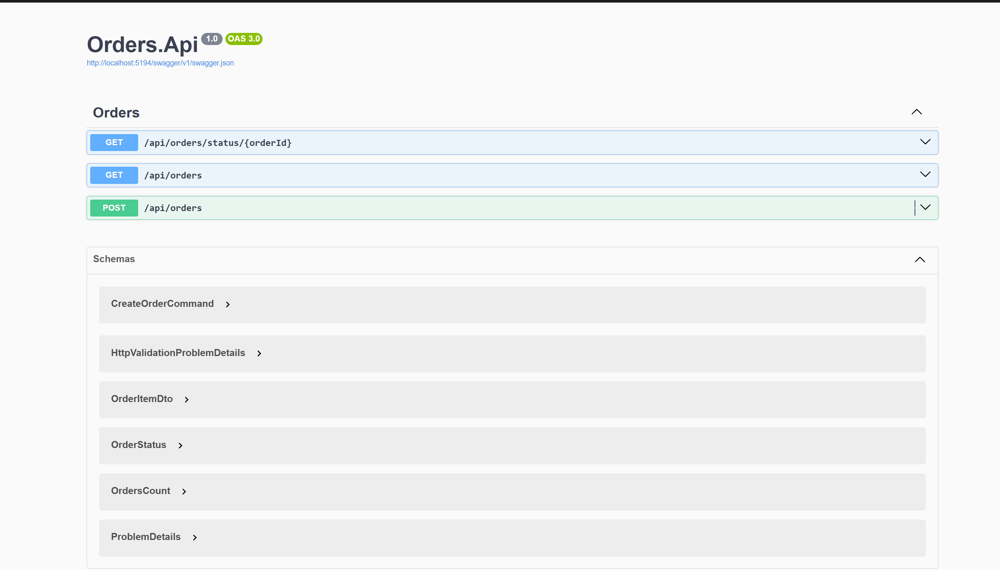
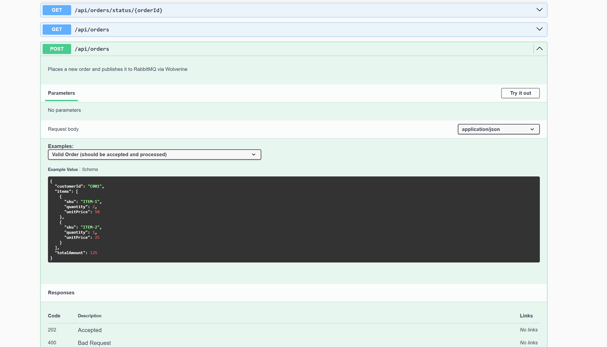
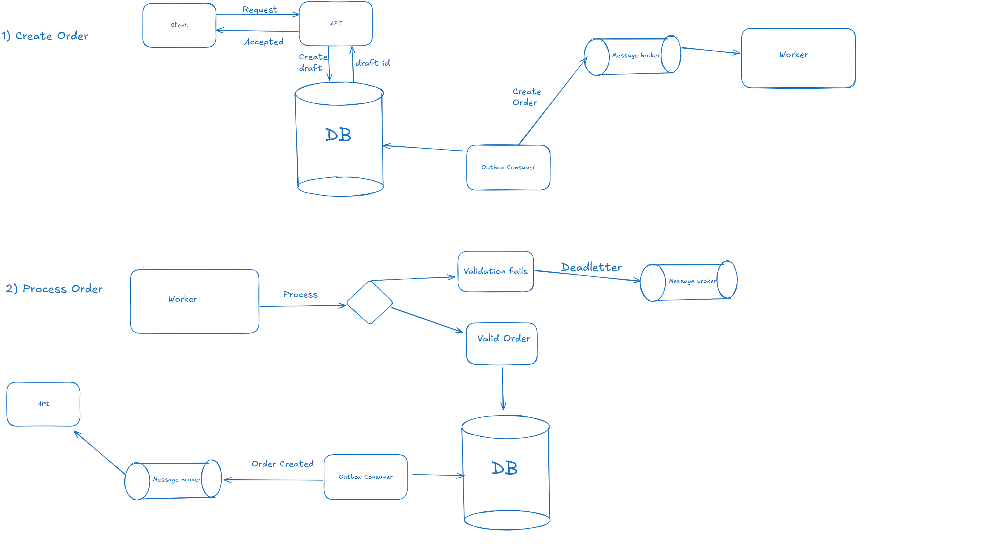

To run the project, you should have:
- **Docker Desktop** installed - to run from docker-compose
- **Visual Studio or Rider** (with .NET 8) to check the code or run by yourself

Run the project:
- `git clone https://github.com/ohurskyi/tech-task.git`
- `cd .\tech-task`
- docker-compose up -d
- navigate to http://localhost:8080/swagger in browser

Tech stack:
- NET 8
- PostgreSQL
- RabbitMQ

Simple diagram
